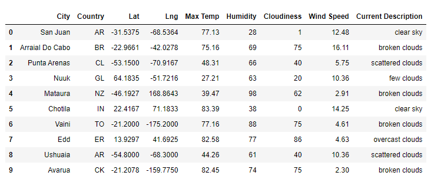
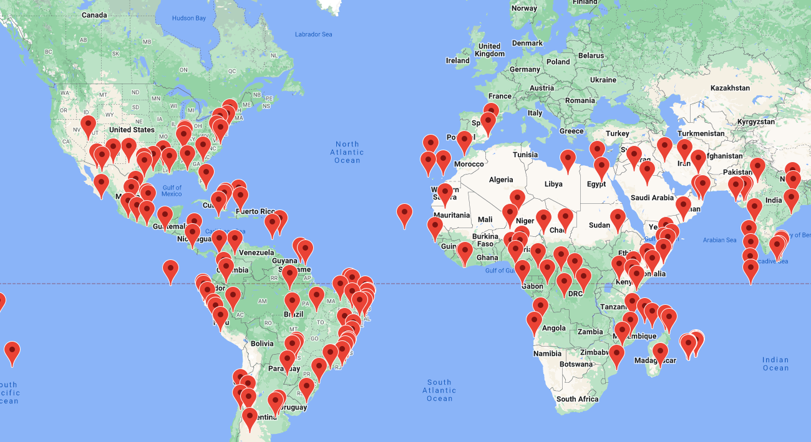
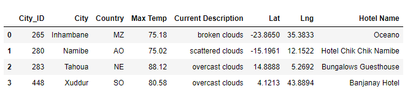
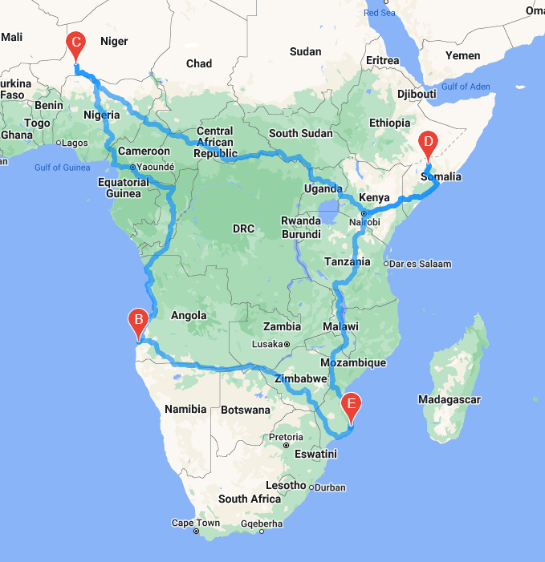
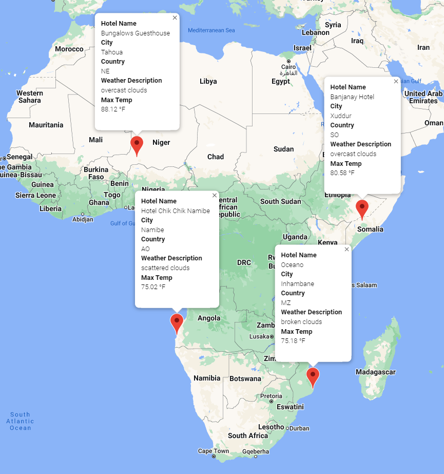

# World Weather Analysis

## Overview of Project
The PlanMyTrip App has been launched to Beta testers, the testers provided feedback on the app and requested adding weather descriptions to the weather data. Secondly, they want to see input statements that further filter the data to their weather preferences to identify potential travel destinations and nearby hotels. From that information they want to be able to choose four cities to create a travel itinerary and have a map created to show the travel route between the cities visited.

## Data Sources
`CitiPy`, `Jupyter Notebook` with `gmaps`, `OpenWeatherMap API`, `Google Maps and Places API`, and `Google Maps Directions API`.

## Results
### Retrieve Weather Data with API
The `NumPy` function was used in conjunction with the `random` function to put together a list of 2,000 cities with weather information. After the data retrieval was complete, the information was converted to a pandas DataFrame called `city_data_df`.

The Dataframe was then converted into a CSV file, `WeatherPy_Database.csv`, to be referred to later in the below sections.

### Create a Customer Travel Destination Map
The `WeatherPy_Database.csv` was imported into `Vacation_Search.ipynb` to create a Customer Travel Destinations Map. The customer was prompted on the minimum and maximum temperature they would like on their vacation and a new DataFrame was built to reflect these preferences.

Within that DataFrame, the information was cleaned up and a new section, "Hotel Name", was added. Parameters were set and a `for` loop was used to iterate through the rows of data and pulled information on nearby hotels. The Hotels were added to the DataFrame and was converted to a CSV file, `WeatherPy_vacation.csv`.

A `WeatherPy_vacation_map` was created:

### Create a Travel Itinerary Map
The `WeatherPy_vacation.csv` was then imported into the `Vacation_Itinerary.ipynb` to create a DataFrame to add 3 cities to an Itinerary for the trip to Inhambane. 

A Directional Layer Map was created to show the the travel route of the above cities.

A Marker Layer Map was created to show the cities and the weater and hotel information in the form of markers.

